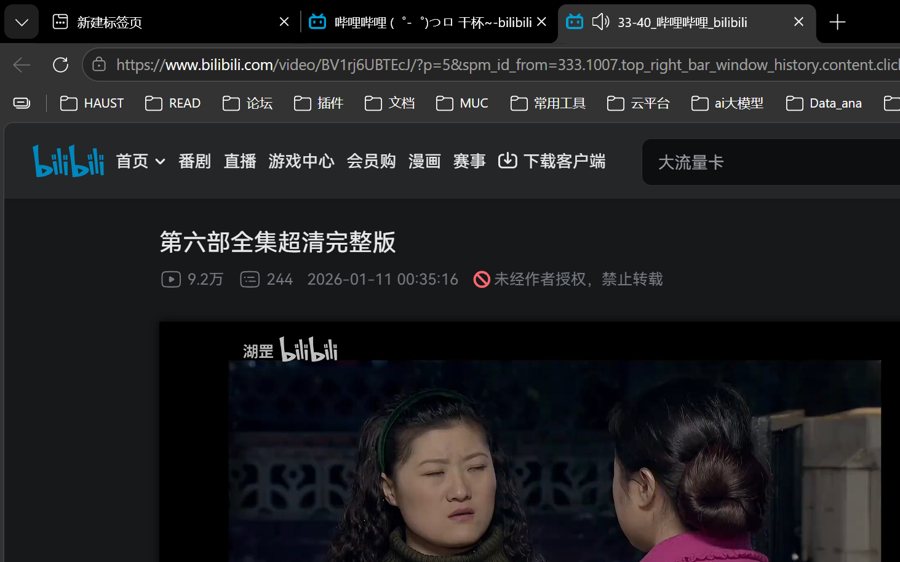

# QSrcRecorder · 拾光留影

<p align="center">
  
</p>

<p align="center">
  <strong>一个 Windows 轻量级录屏工具</strong><br/>
  单文件夹绿色运行 · 摄像头画中画 · 多声道音频 · 音效调节
</p>

---

## 简介

**QSrcRecorder（拾光留影）** 是一款面向 Windows 的轻量级屏幕录制工具，专注于：

- **简洁易用** — 单文件夹绿色运行，无需安装
- **高质量录制** — 硬件编码 + 软件兜底，稳定高效
- **多功能音频** — 系统声音 / 麦克风独立录制，支持音效调节
- **摄像头画中画** — 录制时实时预览，成片自动叠加

### 适用场景

| 场景 | 说明 |
|------|------|
| 在线教学 | 摄像头 + 屏幕同步录制 |
| 游戏录制 | 低延迟、高帧率 |
| 软件演示 | 窗口/区域精准录制 |
| 会议记录 | 系统声音 + 人声双通道 |

---

## 功能特性

### 核心功能

| 功能 | 状态 | 说明 |
|------|------|------|
| 全屏录制 | ✅ | 捕获整个显示器 |
| 区域录制 | ✅ | 框选特定区域录制 |
| 窗口录制 | ✅ | 指定应用窗口录制 |
| H.264 MP4 输出 | ✅ | faststart 优化，支持流式播放 |
| 硬件编码 | ✅ | NVENC / QuickSync / AMF 自动选择 |
| 软件编码兜底 | ✅ | 硬编失败时自动切换 libx264 |
| 帧率可选 | ✅ | 24 / 30 / 60 fps |
| 画质调节 | ✅ | 高 / 中 / 低 三档 |
| 分辨率缩放 | ✅ | 100% / 75% / 50%，降低带宽 |

### 音频功能

| 功能 | 状态 | 说明 |
|------|------|------|
| 系统声音录制 | ✅ | WASAPI Loopback，无需虚拟声卡 |
| 麦克风录制 | ✅ | WASAPI Capture，设备原生格式 |
| 独立音量调节 | ✅ | 麦克风 / 系统声音分别控制 |
| 降噪门 | ✅ | 过滤环境底噪 |
| 低音 / 高音 | ✅ | 系统声音频响调节 |
| 音频合成 | ✅ | 录制结束后 ffmpeg 合并 |

### 增强功能

| 功能 | 状态 | 说明 |
|------|------|------|
| 摄像头画中画 | ✅ | 右下角叠加，可拖动调整 |
| 鼠标点击高亮 | ✅ | 光圈动画，颜色可自定义 |
| 鼠标跟随圆 | ✅ | 常驻高亮，提升演示效果 |
| 快捷键支持 | ✅ | F9 开始/停止，F10 暂停/继续 |
| 录制悬浮条 | ✅ | 显示时长，可隐藏收进托盘 |
| 设置持久化 | ✅ | 自动保存所有配置 |

### 即将推出

| 功能 | 计划版本 |
|------|----------|
| 定时自动停止 | v0.3 |
| 录制倒计时 | v0.3 |
| 多显示器支持 | v0.3 |
| 摄像头美颜 | v0.4 |
| 录制历史列表 | v1.0 |
| 安装包发布 | v1.0 |

---

## 环境要求

### 运行环境

- **操作系统**：Windows 10 1903+ / Windows 11
- **运行时**：自带 .NET 8 运行时（自包含版本）
- **显卡**：支持 DirectX 11 及以上（硬件编码需要）

### 开发环境

- **.NET 8 SDK** — 用于编译和调试
- **ffmpeg** — 内置于 `tools/ffmpeg/` 目录

---

## 快速开始

### 方式一：直接运行（推荐）

1. 从 [Releases](https://github.com/qiz7z/QSrcRecorder/releases) 下载 `QSrcRecorder-v0.2.exe`
2. 双击运行即可，无需安装

### 方式二：本地构建

```bash
# 克隆仓库
git clone https://github.com/qiz7z/QSrcRecorder.git
cd QSrcRecorder

# 构建并发布（自包含 exe）
dotnet publish src/ScreenRecorder -c Release -r win-x64 --self-contained true -o publish

# 运行
./publish/QSrcRecorder.exe
```

### 方式三：开发调试

```bash
# 直接运行（需要 .NET 8 运行时）
dotnet run --project src/ScreenRecorder

# 运行单元测试
dotnet test src/ScreenRecorder.Tests

# 端到端冒烟测试
dotnet run --project src/ScreenRecorder.Smoke -c Release
```

---

## 快捷键

| 快捷键 | 功能 |
|--------|------|
| `F9` | 开始 / 停止录制 |
| `F10` | 暂停 / 继续录制 |

---

## 架构设计

```
┌─────────────────────────────────────────────────────────────┐
│                         UI 层 (WPF)                        │
│  MainView · 参数卡片 · 摄像头设置 · 音效面板 · 点击高亮      │
└───────────────────────────┬─────────────────────────────────┘
                            │
┌───────────────────────────▼─────────────────────────────────┐
│                      会话控制层                              │
│  RecordingSession · RecordingOptions · RecordingResult      │
└─────────┬───────────────────────┬───────────────────────────┘
          │                       │
┌─────────▼──────────┐  ┌─────────▼──────────┐
│    采集引擎         │  │    音频捕获          │
│  WgcCapture        │  │  AudioCapture      │
│  (Windows Graphics │  │  SystemAudioCapture│
│   Capture)         │  │  (WASAPI)          │
└─────────┬──────────┘  └─────────┬──────────┘
          │                       │
┌─────────▼───────────────────────▼──────────┐
│                    编码器                   │
│         FfmpegVideoEncoder                  │
│    (NVENC / QSV / AMF / libx264)           │
└────────────────────────────────────────────┘
```

### 关键设计决策

1. **软件合帧** — 摄像头 / 点击高亮直接绘制到帧缓冲，不依赖屏上覆盖层，确保窗口模式也能生效
2. **双缓冲队列** — 采集线程与编码线程分离，避免丢帧
3. **硬编兜底** — NVENC 失败时自动切换 libx264，保证录制成功率
4. **WASAPI 原生** — 麦克风使用设备原生格式，避免 WinMM 立体声兼容问题

---

## 技术栈

| 层级 | 技术 |
|------|------|
| UI | WPF + WinForms 混合 |
| 采集 | Windows Graphics Capture (WGC) |
| 编码 | ffmpeg (NVENC / QSV / AMF / libx264) |
| 音频 | NAudio (WASAPI) |
| 互操作 | CsWin32 (D3D11 / WinRT) |
| 测试 | xUnit |

---

## 已知限制

- DRM 保护内容（Netflix 等）会录制为黑屏，属系统限制
- Windows 10 21H1 及更早版本会出现黄色窗口边框
- 区域选择仅支持单显示器
- 暂停期间不支持插入定格画面
- 录制悬浮条默认显示在右下角，无法自定义位置

---

## 路线图

| 版本 | 状态 | 功能 |
|------|------|------|
| v0.2 | ✅ 已完成 | 多声道音频、摄像头画中画、音效调节、点击/鼠标高亮 |
| v0.3 | 🚧 规划中 | 定时自动停止、多显示器支持、录制倒计时 |
| v1.0 | 📋 规划中 | 安装包发布、录制历史列表、性能优化 |

---

## 项目结构

```
QSrcRecorder/
├── src/
│   ├── ScreenRecorder/          # 主程序
│   │   ├── Assets/              # 图标资源
│   │   ├── Audio/               # 音频捕获 (WASAPI)
│   │   ├── Capture/             # 屏幕采集 (WGC + D3D11)
│   │   ├── Encoding/            # 编码器 (ffmpeg)
│   │   ├── Interop/             # Win32 / WinRT 互操作
│   │   ├── Overlays/            # 覆盖层 (悬浮条、点击高亮、画中画)
│   │   ├── Settings/            # 配置持久化
│   │   └── UI/Wpf/              # WPF 主界面
│   ├── ScreenRecorder.Tests/    # 单元测试
│   └── ScreenRecorder.Smoke/    # 冒烟测试
├── tools/
│   └── ffmpeg/                  # 内置 ffmpeg
├── docs/
│   └── design-system.md         # 设计系统文档
└── README.md
```

---

## 贡献指南

欢迎提交 Issue 和 Pull Request！

1. Fork 本仓库
2. 创建特性分支 (`git checkout -b feature/AmazingFeature`)
3. 提交更改 (`git commit -m 'Add some AmazingFeature'`)
4. 推送到分支 (`git push origin feature/AmazingFeature`)
5. 开启 Pull Request

---

## 许可证

本项目采用 [MIT License](LICENSE) 开源。

---

## 致谢

- [ffmpeg](https://ffmpeg.org/) — 强大的音视频处理工具
- [NAudio](https://github.com/naudio/NAudio) — .NET 音频库
- [Windows Graphics Capture](https://learn.microsoft.com/en-us/windows/win32/winprog/using-windows-graphic-capture) — Windows 系统 API
- [ui-ux-pro-max](https://github.com/uiux-pro-max) — UI/UX 设计智能

---

<p align="center">
  <sub>Built with ❤️ by <a href="https://github.com/qiz7z">qiz7z</a></sub>
</p>
